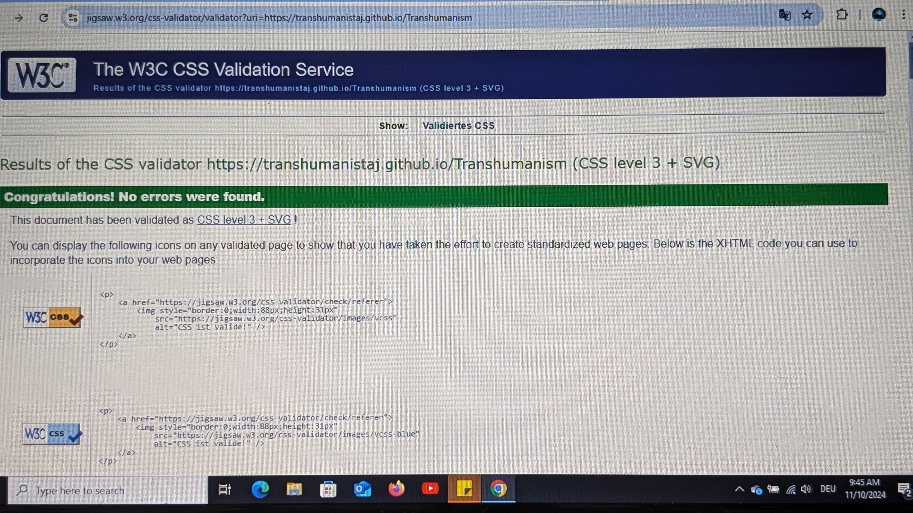
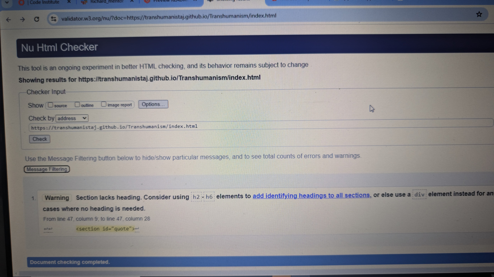
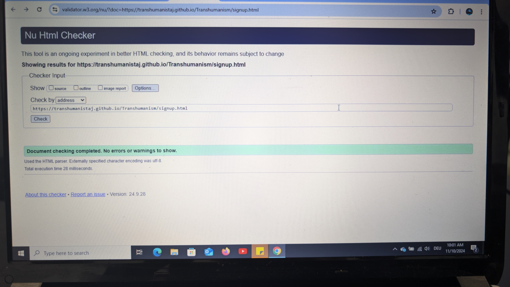
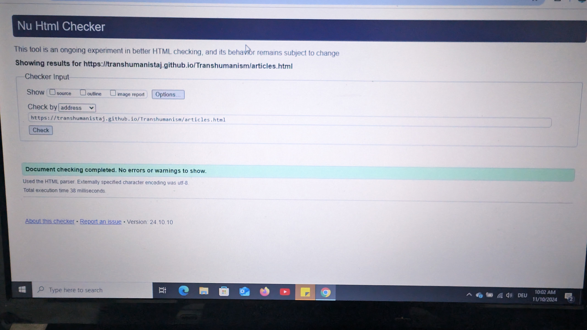

# Transhumanism and Longevity

The "Transhumanism and Longevity" website explores advanced technology and human enhancement. This platform provides informative articles and a sign-up feature to keep users updated on related topics. The website is designed for an optimal user experience across various devices.

## Table of Contents
- Objectivity
- Usage
- Screenshots
- Credits
- License

## Objectivity
The "Transhumanism and Longevity" website is dedicated to bridging the gap between cutting-edge science and everyday human experience. Our goal is to educate and engage the public on the transformative potential of advanced technologies in human enhancement and longevity. Through insightful articles, a user-friendly sign-up system, and responsive design, we aim to foster a deeper understanding of how these innovations can enhance life. I desined it as to widen a journey to explore the future of human potential and stay informed about the latest developments in transhumanism and longevity. This website is a great opportunity ro navigate the frontier where science meets humanity.

## Usage
The project "Transhumanism and Longevity" is a simple website designed to provide information about transhumanism and its impact on human longevity. The website consists of three main HTML files: index.html, signup.html, and articles.html.
## Responsiveness:

### I made sure it is responsive to all devices.
##### I tested it and found no errors:
1: https://jigsaw.w3.org/css-validator/validator?uri=https://transhumanistaj.github.io/Transhumanism

2: https://validator.w3.org/nu/?doc=https://transhumanistaj.github.io/Transhumanism/index.html

3:https://validator.w3.org/nu/?doc=https://transhumanistaj.github.io/Transhumanism/signup.html

4:https://validator.w3.org/nu/?doc=https://transhumanistaj.github.io/Transhumanism/articles.html

### Navigation
- *Home*: The index.html file serves as the homepage. It includes a navigation bar with links to the Home page, Articles page, and Sign Up page. Under the welcome section, In the middle of the page, we have a quote by Ray Kurzweil to demonstrate that we have to life a life worth remembering. right below it we have 
In the coming soon section. It is to imply that the website has new upcoming updates as a trick to keep the user entitled to checking my website every now and then. It is a quick access to yet waited updates coming in the near future. Below it we have the About which addresses our objective as to why we have created this website and whom we are targeting.
Below it is the Contact which I have designed to ensure smooth and swift contact between the user and "Company". I also added a text with the email highlighting different potential opportunities to encourage the user more to contact us.

- *Articles*: The articles.html file contains various articles related to transhumanism and longevity. You can access this page by clicking on the "Articles" link in the navigation bar. Here I posted two articles to enrich the user's knowledge in this new yet fascinating topic.

- *Sign Up*: The signup.html file provides a form for users to sign up for updates and newsletters. This page can be accessed by clicking on the "Sign Up" link in the navigation bar. This is a simple and well colored webpage designed to allow the user create an account and join us for updates, email, etc....
I also made it mandatory to fill up all the gaps so that the user doesnt miss on out.
I also designed "being inspired by the love running lets get signed up" to create a link after submission. Image below after submission.

### How to Use
1. *Open the Homepage*: Start by opening the index.html file in your web browser. This will display the homepage with the navigation bar. You can either scroll down manually or use the li for a auto smooth scroll. You go down and read the qoute by Ray Kurzweil and then have a quick view for the coming soon as they are not updated by our company, you can scroll belower to find our message in the About element. And then if you are interested, you can scroll below it to find our email to contact us. There is a detailed p element with it. You can click on the read more below the Articles element...
2. *Navigate to Articles*: Click on the "Articles" button in the navigation bar to view the articles related to transhumanism and longevity. You can scroll down to read the two latest articles. There is the name of the author right below. Scroll up to the sign up
3. *Sign Up for Updates*: Click on the "Sign Up" link in the navigation bar to access the sign-up form. Fill in the required details and submit the form to receive updates and newsletters. It will lead you to the page inspired by the lesson from love running.

## **Deployment**
This website was deployed on GitHub Pages. The following procedure was followed on desktop to achieve this:
- Starting at [**this project's repository**](https://github.com/TranshumanistAJ/Transhumanism.git), navigate to the **'Settings'** tab
- In **'Settings'**, select **'Pages'** from the navigation menu on the left-hand side of the screen
- In **'GitHub Pages'**, find **'Source'** under **'Build and deployment'**
- Select the **'Main'** branch from the drop down menu and click **'Save'**
- A message is then displayed to indicate a successful deployment to GitHub pages, and provides a live link once it has finished fully deploying

The live link to the fully deployed website can be found here: [***https://transhumanistaj.github.io/Transhumanism/index.html***](https://emmacadavra.github.io/ci-portfolio1-spc/)

## **Responsive Testing**
- Tested on iPhone 12, Samsung Galaxy S10, and iPad Mini.
- Used Chrome DevTools to simulate different screen sizes (mobile, tablet, desktop).
- Verified that elements adjusted correctly (text resizing, images scaling, layouts changing).

## **Manual Testing**
- I made sure to check the functionality by hand as follows:

1: Clicked all links to ensure they navigate correctly.
 
 2: Filled out and submitted forms to check for proper handling and validation.
 
 3: Tested site on multiple browsers (Chrome, Firefox, Edge) to ensure consistent behavior.

## **Bugs**
- Issue : The website in its entirety was not responsive to all devices.
- Cause : I forgot to add responsiveness in my CSS file.
- Resolution : I added for e.g @media (max-width: 480px) to all the elements necessary to ensure the responsiveness in all devices.
____
- Issue : The articles.html file was not targeted by the CSS file.
- Cause : I misspelled href="assets/css/styles.css"
- Resolution : I noticed the misspelling and corrected it.
____
- Issue : The social link in my index.html footer were unintentionally aligned to the left side of the page.
- Cause : I did not add the necessary property and value to the class in my CSS file
- Resolution : I added the following property text-align to the social links to ensure making them centered 
social-links {
    list-style: none;
    padding: 0;
    margin: 20px 0 0;
    text-align: center; }

## Credits
1: Lesson: Special thanks to the makers of Love Running project that inspired my work to design the Sign Up and the page after submitted.

2: Heartfelt thanks to my mentor, Tim Nelson, for providing the essential support needed to complete my first HTML and CSS project. Your guidance and encouragement were invaluable throughout this learning experience.

## License
1: all images taken from : https://wallpapercave.com/transhumanism-wallpapers .

2: Articles were generated by AI (more detail found as comments in the files themselves)
